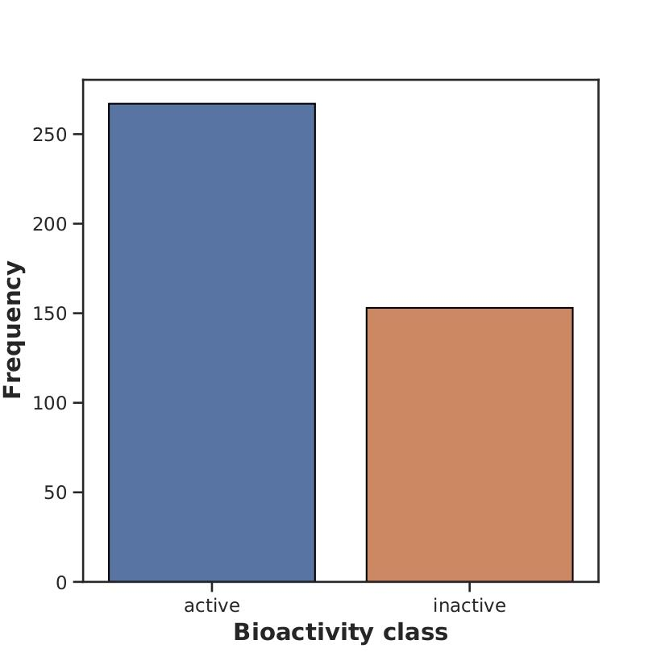
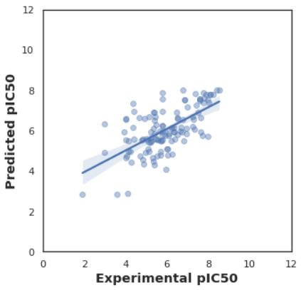
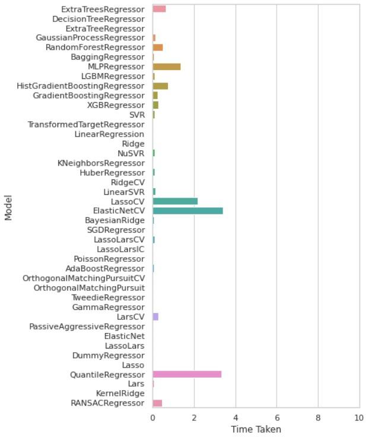

# Drug Discovery: Antivenom Modelling

## Overview
This repository contains a machine learning-based approach to develop a broad-spectrum antivenom targeting **Phospholipase A2 (PLA2)**, a key enzyme in snake venom. The project involves data collection, exploratory data analysis, and predictive modeling using machine learning algorithms. It also includes a web application for user-friendly compound activity prediction.

## Repository Structure
```
Drug_Discovery_Antivenom_Modelling/
│
├── CDD_ML_Part_1_bioactivity_data.ipynb           # Data collection and cleaning
├── CDD_ML_Part_2_Exploratory_Data_Analysis_Phospholipase_A2.ipynb
├── CDD_ML_Part_3_PhospholipaseA2GroupIIA_Descriptor_Dataset_Preparation.ipynb
├── CDD_ML_Part_4_PhospholipaseA2_Regression_Random_Forest.ipynb
├── CDD_ML_Part_5_PhospholipaseA2_Compare_Regressors.ipynb
│
├── Drug_Discovery_Antivenom_Modelling.pdf         # Detailed project report
├── requirements.txt                               # Python dependencies
├── images/                                        # Folder containing visualizations
│   ├── fig1.png                                   # Frequency of active/inactive molecules
│   ├── fig2.png                                   # pIC50 distribution
│   ├── fig3.png                                   # LogP values
│   ├── fig4.png                                   # Molecular weight
│   ├── fig5.png                                   # NumHAcceptors
│   ├── fig6.png                                   # NumHDonors
│   ├── fig7.png                                   # Predicted vs Experimental pIC50
│   ├── fig8.png                                   # RMSE comparison
│   ├── fig9.png                                   # Model training time
```

## Objectives
1. Develop a machine learning model to predict the **pIC50** (bioactivity) of compounds targeting PLA2.
2. Conduct exploratory data analysis to identify key molecular features.
3. Create a web app for easy compound activity predictions.

## Setup Instructions
### Prerequisites
Ensure you have Python (≥3.7) and `pip` installed.

### Installation
1. Clone the repository:
   ```bash
   git clone https://github.com/your-username/Drug_Discovery_Antivenom_Modelling.git
   cd Drug_Discovery_Antivenom_Modelling
   ```
2. Install the required packages:
   ```bash
   pip install -r requirements.txt
   ```

### Running the Jupyter Notebooks
Run the notebooks in sequence using Jupyter or JupyterLab:
1. Start Jupyter:
   ```bash
   jupyter notebook
   ```
2. Open and execute the notebooks in the following order:
   - `CDD_ML_Part_1_bioactivity_data.ipynb`
   - `CDD_ML_Part_2_Exploratory_Data_Analysis_Phospholipase_A2.ipynb`
   - `CDD_ML_Part_3_PhospholipaseA2GroupIIA_Descriptor_Dataset_Preparation.ipynb`
   - `CDD_ML_Part_4_PhospholipaseA2_Regression_Random_Forest.ipynb`
   - `CDD_ML_Part_5_PhospholipaseA2_Compare_Regressors.ipynb`

### Viewing Results
- Visualizations and analysis results can be found in the `images` folder or within the notebooks.
- Refer to `Drug_Discovery_Antivenom_Modelling.pdf` for detailed documentation.

## Key Results
### Visualizations
#### Frequency of Active/Inactive Molecules


#### Predicted vs Experimental pIC50


#### RMSE Comparison


#### Model Training Time


(*More visualizations are in the `images` folder.*)

### Performance
- The Random Forest model achieved an RMSE of **0.7** and demonstrated high predictive accuracy.
- Comparative analysis showed Random Forest to be reliable and efficient, balancing accuracy and training time.

## References
For a detailed explanation of the methodology, analysis, and results, refer to:
- `Drug_Discovery_Antivenom_Modelling.pdf` (included in this repository)
- **References within the PDF report**

## Contributions
Contributors:
- **Ankeet Singh** (Roll No: 19112001)
- **Brijesh Painkra** (Roll No: 19112009)

Supervised by **Dr. D.N. Roy**, Department of Biotechnology, NIT Raipur.

---

(*Feel free to reach out via GitHub issues for questions or suggestions.*)
